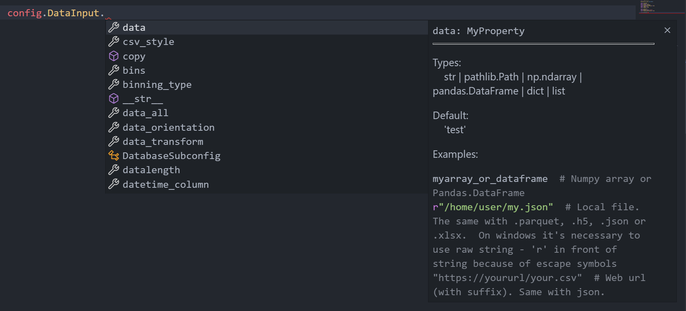

# predictit

[](https://mybinder.org/v2/gh/Malachov/predictit/HEAD?filepath=demo.ipynb) [](https://pypi.python.org/pypi/predictit/) [](https://badge.fury.io/py/predictit) [](https://lgtm.com/projects/g/Malachov/predictit/context:python) [](https://predictit.readthedocs.io/en/master/?badge=master) [](https://opensource.org/licenses/MIT) [](https://codecov.io/gh/Malachov/predictit)

Library/framework for making time series predictions. Choose the data, choose the models (ARIMA, regressions, LSTM...) from libraries like statsmodels, scikit-learn, tensorflow. Do the setup (it's not necessary of course - you can use some preset) and predict.

Library contain model Hyperparameter optimization as well as option variable optimization. That means, that library can find optimal preprocessing (smoothing, dropping non correlated columns, standardization) and on top of that it can find optimal hyperparameters such as number of neuron layers.

## Output

Most common output is plotly interactive graph and object with results array, results with history etc...

<p align="center">

</p>

<p align="center">

</p>

## Links

[Repo on github](https://github.com/Malachov/predictit)

[Official readthedocs documentation](https://predictit.readthedocs.io)

## Installation

Python >=3.6 (Python 2 is not supported).

Install just with

```console
pip install predictit
```

Sometimes you can have issues with installing some libraries from requirements (e.g. numpy because not BLAS / LAPACK). There are also two libraries - Tensorflow and pyodbc not in requirements, because not necessary, but troublesome. If library not installed with pip, check which library don't work, install manually with stackoverflow and repeat... 

There are some libraries that not every user will be using (e.g. Tensorflow or libraries for some data inputs). If you want to be sure to have all libraries, you can download `requirements_advanced.txt` and then install advanced requirements with `pip install -r requirements_advanced.txt`.

Versions troubleshooting => Software is build in way, that it should be the best using the latest versions of dependencies. In most cases older versions works well as well. Only exception can be author's library mydatapreprocessing, which is new and under development (API is not stable) and some version of predictit has dependency on particular version of mydatapreprocessing. Clean installation of the latest versions fix issue.

Library was developed during 2020 and structure and even API (configuration) changed a lot. From version 1.60 it's considered to be stable and code made for library will work till 2.0.0.


## How to

Software can be used as a python library or with command line arguments or as normal python script. Main function is `predict` in `main.py` script. There is also `predict_multiple_columns` function if you want to predict more at once (columns or time frequencies) and also `compare_models` function that tell you which models are best. It evaluates error criterion on out of sample test data instead of predict (which use as much data as possible). Some models, for example decision trees just assign input from learning set, so error in predict is 0, in compare_models its accurate. So first is optimal to use `compare_models`, find best models and then use it in predict.

Try live demo - playground on [binder](https://mybinder.org/v2/gh/Malachov/predictit/HEAD?filepath=demo.ipynb)

### Config

Import libraries

<!--phmdoctest-setup-->
```python
import predictit
import numpy as np
import pandas as pd

from predictit import config
```

and type `config.`, then, if not automatically, use ctrl + spacebar to see all subcategories and in subcategories, you can see description in the docstrings for all the configurable values.

<p align="center">

</p>

You can edit config in two ways

1) As object attributes

You can use subcategories like `general`, `data_input`, `output`

```python
config.data_input.data = 'https://raw.githubusercontent.com/jbrownlee/Datasets/master/daily-min-temperatures.csv'
```

You can also use config instance directly for all the attributes and omit the subcategories (though without intellisense help).

```python
config.datetime_column = 'Date'  # Will be used for resampling and result plot description
config.freq = "D"  # One day - one value resampling
```

2) You can update multiple parameters at once with dictionary and update function

```python
config.update({
    'datalength': 300,  # Used datalength
    'predicts': 14,  # Number of predicted values
    'default_n_steps_in': 12  # Value of recursive inputs in model (do not use too high - slower and worse predictions)
})

# After if you setup prediction as needed, it's simple

predictions = predictit.predict()
```

If you need create more configurations and don't want to override its values, you can create multiple instances, but you need to insert this new config as function parameter

```python
other_config = config.copy()  # or predictit.configuration.Config()
other_config.predicts = 30  # This will not affect config for other examples
predictions_3 = predictit.predict(config=other_config)
```

### Simple example of using predictit as a python library and function arguments

Although there are many config variables, defaults should be enough.

```python
predictions_1 = predictit.predict(data=np.random.randn(100, 2), predicted_column=1, predicts=3)
```

There are only two positional arguments `data` and `predicted_column`(because, there is more than a hundred configurable values). So you can use also

```python
my_data = pd.DataFrame(np.random.randn(100, 2), columns=['a', 'b'])
predictions_1_positional = predictit.predict(my_data, 'b')
```

### Simple example of using `main.py` as a script

Open `configuration.py` (only script you need to edit (very simple)), do the setup. Mainly used_function and data or data_source and path. Then just run `main.py`.

### Simple example of using command line arguments

Run code below in terminal in predictit repository folder.
Use `python predictit/main.py --help` for more parameters' info.

```console
python predictit/main.py --used_function predict --data 'https://raw.githubusercontent.com/jbrownlee/Datasets/master/daily-min-temperatures.csv' --predicted_column 'Temp'
```

### Example of compare_models function

You can compare it on same data in various parts or on different data (check configuration on how to insert dictionary with data names)

```python
my_data_array = np.random.randn(200, 2)  # Define your data here

config.update({
    'data_all': {'First part': (my_data_array[:100], 0), 'Second part': (my_data_array[100:], 1)},
    'predicted_column': 0
})
compared_models = predictit.compare_models()
```

### Example of predict_multiple function

```python
config.data = np.random.randn(120, 3)
config.predicted_columns = ['*']  # Define list of columns or '*' for predicting all of the numeric columns
config.used_models = ['Conjugate gradient', 'Decision tree regression']  # Use just few models to be faster

multiple_columns_prediction = predictit.predict_multiple_columns()
```

### Example of config variable optimization

```python
config.update({
    'data': "https://raw.githubusercontent.com/jbrownlee/Datasets/master/daily-min-temperatures.csv",
    'predicted_column': 'Temp',
    'datalength': 120,
    'optimization': True,
    'optimization_variable': 'default_n_steps_in',
    'optimization_values': [4, 6, 8],
    'plot_all_optimized_models': False,
    'print_table': 'detailed',  # Print detailed table
    'print_result_details': True,
    'used_models': ['AR', 'Sklearn regression']
})

predictions_optimized_config = predictit.predict()
```

## Hyperparameters tuning

To optimize hyperparameters, just set `optimizeit: 1,` and model parameters limits. It is commented in it's docstrings how to use it. It's not grid bruteforce. It is a heuristic method based on halving interval is used, but still it can be time-consuming. It is recommended only to tune parameters worth of it. Or tune it by parts.

## GUI

It is possible to use basic GUI. But only with CSV data source. Just run `gui_start.py` if you have downloaded software or call `predictit.gui_start.run_gui()` if you are importing via PyPI. Screenshot of such a GUI

<p align="center">

</p>

Better GUI with fully customizable settings will be shipped next year, hopefully.

## Categorical embeddings

It is also possible to use string values in predictions. You can choose config values 'embedding' 'label' and every unique string will be assigned unique number, 'one-hot' create new column for every unique string (can be time-consuming).

## Feature engineering

For feature derivation, you can use difference transformations, first and second order differences, multiplications of columns, rolling mean, rolling standard deviations and also rolling fourier transform.

Feature selection is under development right now :[

## Data preprocessing, plotting and other Functions

You can use any library functions separately for your needs of course. mydatapreprocessing, mylogging and mypythontools are my other projects, which are used heavily. Example is here

```python

import mydatapreprocessing as mdp
from mypythontools.plots import plot
from predictit.analyze import analyze_column

data = "https://blockchain.info/unconfirmed-transactions?format=json"

# Load data from file or URL
data_loaded = mdp.load_data.load_data(data, request_datatype_suffix=".json", predicted_table='txs', data_orientation="index")

# Transform various data into defined format - pandas dataframe - convert to numeric if possible, keep
# only numeric data and resample ifg configured.
data_consolidated = mdp.preprocessing.data_consolidation(
    data_loaded, predicted_column="weight", remove_nans_threshold=0.9, remove_nans_or_replace='interpolate')

# Predicted column is on index 0 after consolidation)
analyze_column(data_consolidated.iloc[:, 0])

# Preprocess data. It return preprocessed data, but also last undifferenced value and scaler for inverse
# transformation, so unpack it with _
data_preprocessed, _, _ = mdp.preprocessing.preprocess_data(data_consolidated, remove_outliers=True, smoothit=False,
                                        correlation_threshold=False, data_transform=False, standardizeit='standardize')

# Plot inserted data
plot(data_preprocessed)

```

## Using just one model apart main function

Main benefit is performance boost. You can have code under the  much simpler (much less code), but no features from configuration available.

```python

import mydatapreprocessing as mdp

data = mdp.generate_data.sin(1000)
test = data[-7:]
data = data[: -7]
data = mdp.preprocessing.data_consolidation(data)
# First tuple, because some models use raw data - one argument, e.g. [1, 2, 3...]
(X, y), x_input, _ = mdp.create_model_inputs.create_inputs(data.values, 'batch', input_type_params={'n_steps_in': 6})

trained_model = predictit.models.sklearn_regression.train((X, y), model='BayesianRidge')
predictions_one_model = predictit.models.sklearn_regression.predict(x_input, trained_model, predicts=7)

predictions_one_model_error = predictit.evaluate_predictions.compare_predicted_to_test(predictions_one_model, test, error_criterion='mape')  # , plot=1
```

## Example of using library as a pro with deeper editing config

```python
config.update(
    {
        "data": r"https://raw.githubusercontent.com/jbrownlee/Datasets/master/daily-min-temperatures.csv",  # Full CSV path with suffix
        "predicted_column": "Temp",  # Column name that we want to predict
        "datalength": 200,
        "predicts": 7,  # Number of predicted values - 7 by default
        "repeatit": 50,  # Repeat calculation times on shifted data to evaluate error criterion
        "other_columns": False,  # Whether use other columns or not
        # Chose models that will be computed - remove if you want to use all the models
        "used_models": [
            "AR",
            "ARIMA",
            "LNU",
            "Conjugate gradient",
            "Sklearn regression",
            "Bayes ridge regression one column one step",
            "Decision tree regression",
        ],
        # Define parameters of models
        "models_parameters": {
            "AR": {
                "used_model": "ar",
                "method": "cmle",
                "trend": "nc",
                "solver": "lbfgs",
            },
            "ARIMA": {
                "used_model": "arima",
                "p": 6,
                "d": 0,
                "q": 0,
            },
            "LNU": {
                "learning_rate": "infer",
                "epochs": 10,
                "w_predict": 0,
                "normalize_learning_rate": False,
            },
            "Conjugate gradient": {"epochs": 200},
            "Bayes ridge regression": {
                "model": "BayesianRidge",
                "n_iter": 300,
                "alpha_1": 1.0e-6,
                "alpha_2": 1.0e-6,
                "lambda_1": 1.0e-6,
                "lambda_2": 1.0e-6,
            },
        },
    }
)

predictions_configured = predictit.predict()
```

## Performance - How to scale

Time series prediction is very different from image recognition and more data doesn't necessarily mean better prediction. If you're issuing performance problems, try fast preset (turn off optimizations, make less recurrent values, choose only few models, threshold datalength etc.) you can edit preset if you need. If you still have performance troubles, and you have too much data, use resampling and select only valuable columns - for example correlation_threshold and do not derive extra columns. If you are interested mostly in predictions and not in the plot, turn the plot off.

## Future work

It's planned to do real GUI and possibility to serve web app as well as desktop. Scalability can be solved two ways. First is incremental learning (not every model supports today). Second is virtualisation (processes running in cluster separately).

There is very big todo list on root called `TODO.md.`

## For developers

Any help from other developers very appreciated... :D
Don't be shy to create Issue, merge request or text on <malachovd@seznam.cz>
